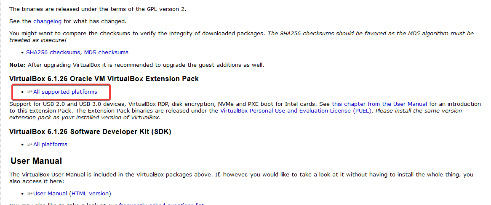
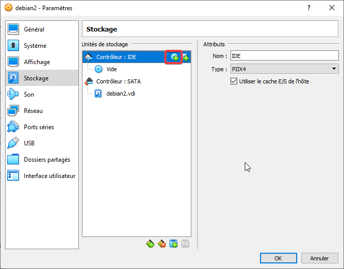
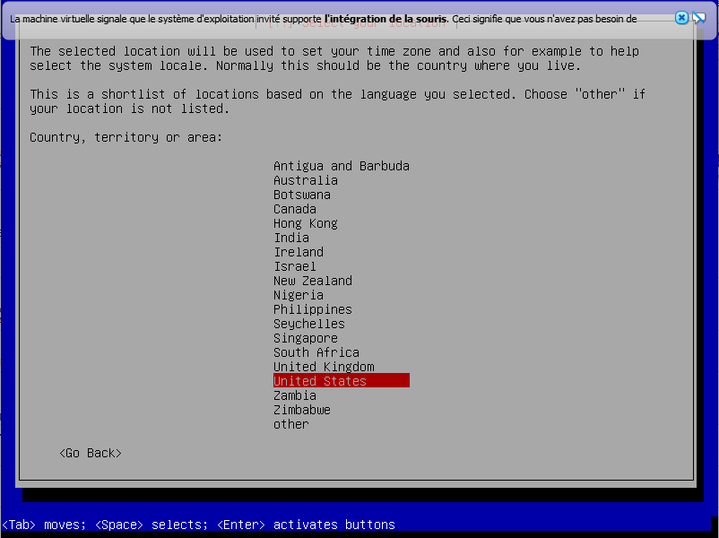
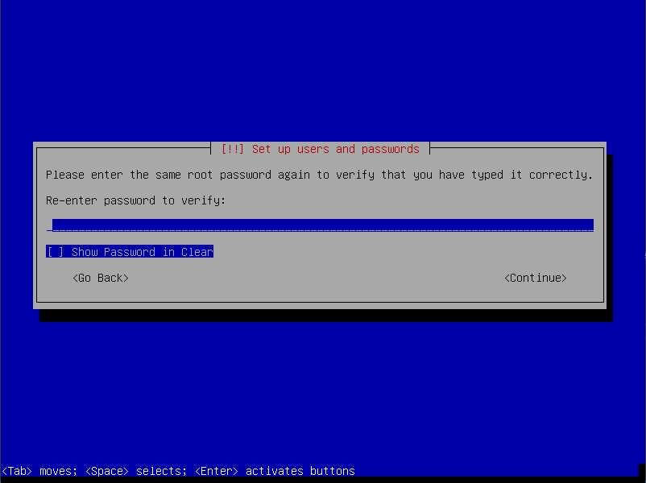
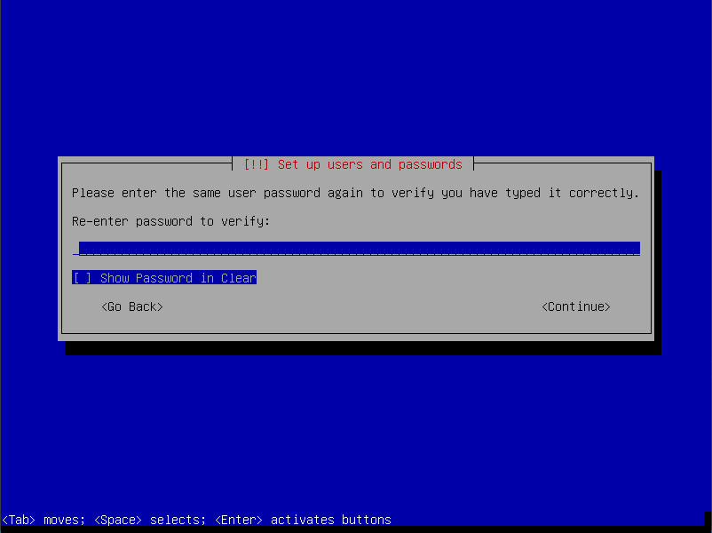
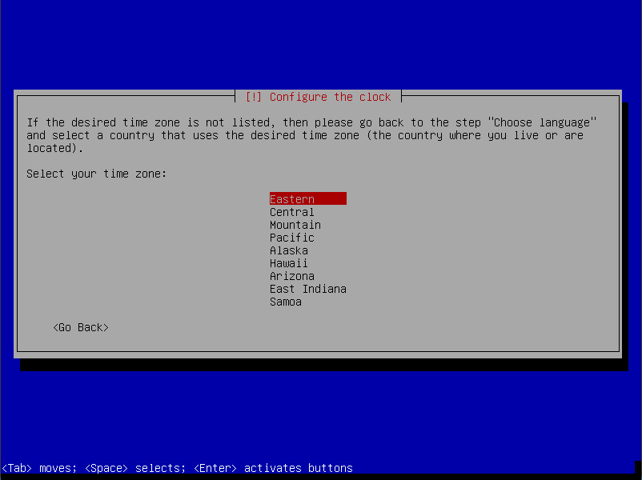

# Projet Infrastructure

## Installation d'une machine virtuelle

### VirtualBox

#### Installation

Allez sur le site de [VirtualBox](https://www.virtualbox.org/).

Sur la page d'accueil, cliquez sur le bouton `Download VirtualBox X.X`.


Téléchargez et installez VirtualBox pour Windows (ne fermez pas la fenêtre du navigateur).


Faites défiler la page précédente, téléchargez et installez `VirtualBox X.X.XX Oracle VM VirtualBox Extension Pack`.



#### Configuration

Exécutez VirtualBox.

Cliquez sur le menu `Machine -> Nouvelle…` (`CTRL+N`).

Dans la boîte de dialogue `Nom et système d'exploitation`, donnez un nom à la nouvelle machine virtuelle (exemple : `debian`), sélectionnez un répertoire de destination, choisissez le type `Linux` et la version `Debian (64-bit)` puis cliquez sur le bouton `Suivant`.


Dans la boîte de dialogue `Taille de la mémoire`, sélectionnez si possible `2048` en RAM puis cliquez sur le bouton `Suivant`.


Dans la boîte de dialogue `Disque dur`, sélectionnez l'option par défaut `Créer un disque dur virtuel maintenant` puis cliquez sur le bouton `Suivant`.


Dans la boîte de dialogue `Type de fichier de disque dur`, sélectionnez l'option par défaut `VDI (VirtualBox Disk Image)` puis cliquez sur le bouton `Suivant`.


Dans la boîte de dialogue `Stockage sur disque dur physique`, sélectionnez l'option par défaut `Dynamiquement alloué` puis cliquez sur le bouton `Suivant`.


Dans la boîte de dialogue `Emplacement du fichier et taille`, laissez le chemin par défaut mais saisissez si possible `20,00` Go en taille du disque virtuel puis cliquez sur le bouton `Créer`.


Une nouvelle machine virtuelle apparaît sur l'écran principal de VirtualBox. Sélectionnez cette machine virtuelle et cliquez sur le bouton `Configuration`.


Dans la section `Système`, onglet `Processeur`, saisissez `2` dans le champ `Nombre de processeurs` et cochez dans les `Fonctions avancées` les options `Activer PAE/NX` et `Activer VT-x/ADM-Vimbriqué` (si disponible).


Dans la section `Réseau`, onglet `Adapter1`, sélectionnez l'option `Accès par pont` dans le `Mode d'accès réseau`. Cliquez ensuite sur le bouton `OK`.

**Remarque :** L'option `Accès par pont` ne marche pas sur le réseau du CESI.


#### Téléchargement d'une image Debian

Récupérez l'image de la dernière version de la distribution Debian sur le site [debian.org](https://www.debian.org/).


#### Sélection de l'image Debian

Dans la section `Stockage`, sur l'option `Controller IDE`, cliquez sur l'icône `Ajoute un lecteur optique.`.



Dans la boîte de dialogue `nom_machine_virtuelle - Optical Disk Selector`, cliquez sur le bouton `Ajouter`.


Dans la boîte de dialogue `Choisissez un fichier de disque optique virtuel`, parcourez votre ordinateur et sélectionnez l'image de Debian puis cliquez sur le bouton `Ouvrir`.


Dans la boîte de dialogue `nom_machine_virtuelle - Optical Disk Selector`, sélectionnez l'image disque de Debian et cliquez sur le bouton `Choisir`.

Fermez la boite de dialogue `Paramètres` en cliquant sur le bouton `OK`.

#### Installation de Debian

Sur l'écran principal de VirtualBox, sélectionnez la machine virtuelle et cliquez sur le bouton `Démarrer`.

Lors de l'installation de Debian, utilisez les flèches du clavier pour effectuer une sélection, la touche `ESPACE` pour cocher une option et la touche `ENTREE` pour valider.

Sélectionnez l'option `Install`.

**Très important !** Sélectionnez l'option `Install` et surtout pas l'option `Graphical Install`.


Sélectionnez la langue utilisée lors de l'installation et validez.

**Remarque :** Il est préférable d'utiliser l'anglais pour faciliter la recherche lors de l'apparition de messages d'erreur.


Sélectionnez la time zone `United States`.

**Remarque :** Si vous ne trouvez pas le français, sélectionnez l'option `Other`, puis `Europe`, puis `France`. Cependant, un problème va se produire par la suite car le language anglais et la time zone française ne sont pas compatible.



Sélectionnez le type de clavier `French`.


Saisissez le nom de la machine virtuelle.


Saisissez le nom de domaine de la machine virtuelle.


Saisissez le mot de passe du compte *root*.

**Attention !** Le compte *root* est l'administrateur principal de la machine. Il est très important de sécuriser ce mot de passe.


Saisissez à nouveau le mot de passe du compte *root*.

**Remarque :** Vous pouvez afficher les mots de passe en clair si vous cochez la case `Show Password in Clear`.



Saisissez le nom complet du premier compte utilisateur.


Saisissez l'identifiant du premier compte utilisateur.


Saisissez le mot de passe du compte utilisateur.


Saisissez à nouveau le mot de passe du compte utilisateur.



Sélectionnez la time zone de la machine (le choix n'est pas important et pourra être modifié par la suite).



Sélectionnez l'option `Guided - use entire disk` pour partitionner et utiliser l'intégralité de l'espace disque réservé lors de la configuration de la machine virtuelle.


Vérifiez que le disque sélectionné est bien le bon.


Sélectionnez l'option de partitionnement `All files in one partition (recommended for new users)`.


### Apache

[A REDIGER]

### MariaDB

[A REDIGER]

### PHP

[A REDIGER]

#### PHPMyAdmin

[A REDIGER]

### Wordpress

#### Installation

Positionnez-vous dans le dossier `/var/www/` :

```
sudo cd /var/www
```

Téléchargez l'archive de Worpress :

```
sudo wget https://wordpress.org/latest.tar.gz
```

Décompressez l'archive :

```
sudo tar -xzvf latest.tar.gz
```

Le dossier `wordpress` conrrespond à la racine du site Wordpress.

Supprimez l'archive devenue inutile.

```
sudo rm latest.tar.gz
```

#### Configuration d'un vhost associé à Wordpress

[A REDIGER]

#### Configuration de Wordpress

Vous pouvez accéder au site Wordpress depuis une machine cliente si vous utilisez l'adresse IP de la machine virtuelle dans le navigateur.

```
XXX.XXX.XXX.XXX
```

Il vaut mieux toutefois configurer le fichier `hosts` de la machine cliente pour accéder au site en utilisant un nom de domaine.

##### Association du nom de domaine à la machine virtuelle sur le client

Vous devez éditer le fichier `hosts` de votre machine cliente pour associer l'adresse IP de la machine virtuelle où est hébergée le serveur web et le nom de domaine.

Sur Windows, ce fichier `hosts` se situe à l'emplacement `C:\Windows\System32\drivers\etc\`.

**Attention !** Avant de l'ouvrir avec un éditeur de texte, vous devez modifier les droits associés à ce fichier.

Faites un clic droit sur le fichier `hosts` et sélectionnez l'option `Propriétés`.

Cliquez sur le bouton `Modifier...` dans la boite de dialogue `Propriétés de : hosts`.


Sélectionnez `Utilisateurs (nom_machine\Utilisateurs)` dans la section `Noms de groupes ou d'utilisateurs` et cochez la case `Contrôle total, Autoriser` dans la section `Autorisations pour Utilisateurs` puis cliquez sur le bouton `OK`.


Sur Linux, ce fichier `hosts` se situe à l'emplacement `/etc/`.

Ouvrez le fichier `hosts` avec un éditeur de texte. Ajoutez une ligne avec l'adresse IP du serveur Linux suivie du nom de domaine.

```
XXX.XXX.XXX.XXX domaine.com
```


##### Configuration de Wordpress

Ouvrez le navigateur et accédez au domaine associé au chemin vers Wordpress sur le serveur web :

```

```


Accéder à une machine en SSH

```
ssh -p numero_port identifiant@adresse_machine
```


Connaitre son IP sur Windows

Commande `ipconfig`
```
Carte réseau sans fil Wi-Fi :
    ...
   Adresse IPv4. . . . . . . . . . . . . .: XXX.XXX.XXX.XXX
   ```

Connaître son IP sur Linux

Commande `hostname -I`

Nom de domaine pour notre projet : group2.local

Créer une IP statique

Vérifier que le paquet `ifupdown` est installé.

```
ifup
```

S'il n'est pas installé :

```
sudo apt-get install ifupdown
```

Vider le cache DNS de windows

```
ipconfig /flushdns
```

Configuration du fichier hosts

La machine qui souhaite consulter le site sur le serveur web doit configurer son fichier hosts pour associer le nom de domaine avec l'adresse IP du serveur.
192.168.10.10 domaine.com

Sur Windows, le fichier hosts se trouve à l'emplacement C:/windows/system32/drivers/etc.
Sur Linux, le fichier hosts se trouve à l'emplacement /etc/.

Sur le serveur, le fichier hosts doit également être configuré car le serveur web peut proposer plusieurs noms de domaines. Il faut associer le nom de domaine avec l'adresse IP 127.0.0.1.
127.0.0.1 localhost domaine.com

Savoir si un service est lancé au démarrage

```
service --status-all
```

- Un service avec `+` indique qu'il est démarré.
- Un service avec `-` indique qu'il est arrêté.

Si le service apache2 est démarré, le critère est validé.

